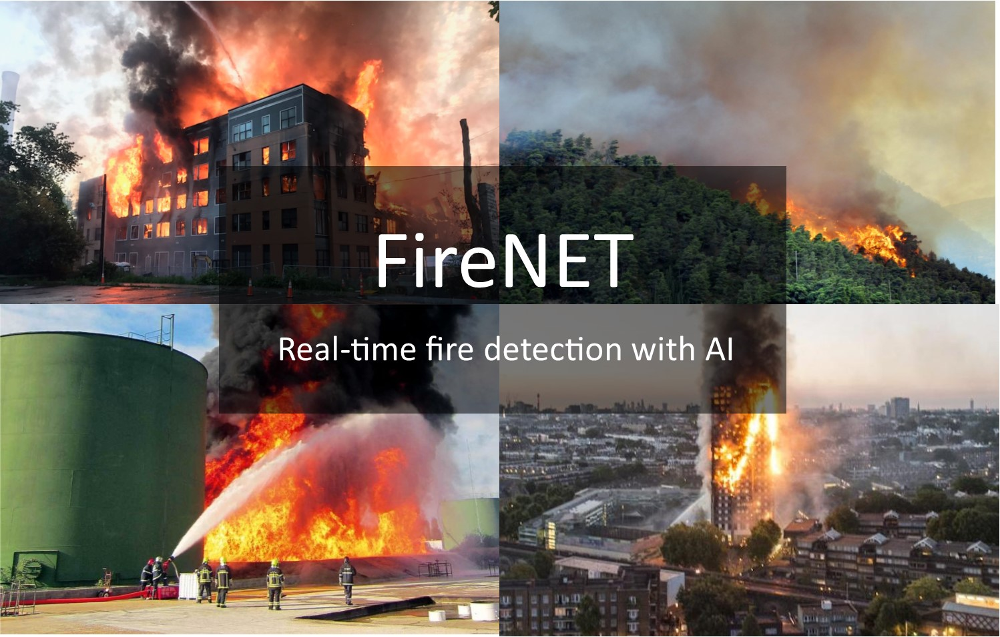
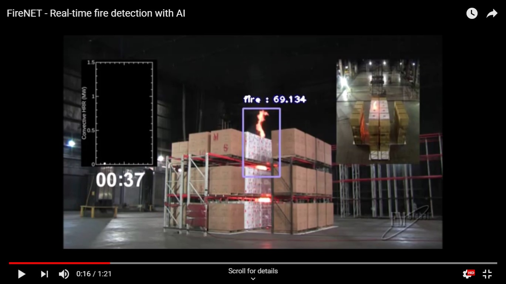
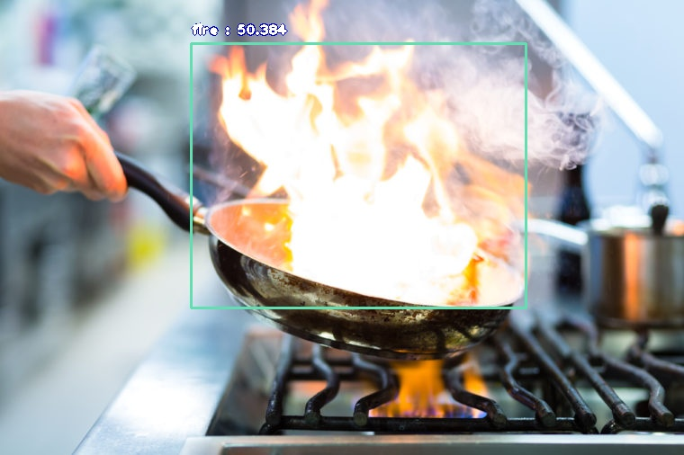
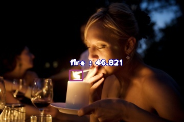

# FireNet
FireNet is an artificial intelligence project for real-time fire detection.
  

<b>FireNet</b> is a real-time fire detection project containing an annotated dataset, pre-trained models and inference codes, all created to ensure that machine learning systems can be trained
 to detect fires instantly and eliminate false alerts. This is part of <a href="https://deepquestai.com" >DeepQuest AI</a>'s to train machine learning systems to 
  perceive, understand and act accordingly in solving problems in any environment they are deployed.   

  This is the first release of the FireNet. It contains an annotated dataset of 502 images splitted into 412 images for training and 90 images for validation. 
  
   

  <b>>>> DOWNLOAD, TRAINING AND DETECTION: </b>   
 The <b>FireNet</b> dataset is provided for download in the <b>release</b> section of this repository.
 You can download the dataset via the link below.   <a href="https://github.com/OlafenwaMoses/FireNET/releases/download/v1.0/fire-dataset.zip" >https://github.com/OlafenwaMoses/FireNET/releases/download/v1.0/fire-dataset.zip</a>    

 We have also provided a [ImageAI](https://github.com/OlafenwaMoses/ImageAI) codebase to train a <b>YOLOv3</b> detection model on the images
  and perform detection in mages and videos using a pre-trained model (also using <b>YOLOv3</b>) provided in the release section of this repository.
  The python codebase is contained in the <b><a href="fire_net.py" >fire_net.py</a></b> file and the detection configuration JSON file for detection is also provided the 
  <b><a href="detection_config.json" >detection_config.json</a></b>. The pretrained <b>YOLOv3</b> model is available for download via the link below.    
  <b><a href="https://github.com/OlafenwaMoses/FireNET/releases/download/v1.0/detection_model-ex-33--loss-4.97.h5" >https://github.com/OlafenwaMoses/FireNET/releases/download/v1.0/detection_model-ex-33--loss-4.97.h5</a></b> 
   
 
Running the experiment or detection requires that you have **Tensorflow**, and **Keras**, **OpenCV** and **ImageAI** installed. You can install this dependencies via the commands below.

 <b>- Tensorflow 1.4.0 (and later versions)  </b>      <a href="https://www.tensorflow.org/install/install_windows" style="text-decoration: none;" > Install</a> or install via pip <pre> pip3 install --upgrade tensorflow </pre> 
       
  <b>- OpenCV  </b>        <a href="https://pypi.python.org/pypi/opencv-python" style="text-decoration: none;" >Install</a> or install via pip <pre> pip3 install opencv-python </pre> 
       
   <b>- Keras 2.x  </b>     <a href="https://keras.io/#installation" style="text-decoration: none;" >Install</a> or install via pip <pre> pip3 install keras </pre> 
  
   <b>- ImageAI 2.0.3  </b>  
         <pre>pip3 install imageai --upgrade </pre>     

<b>>>> Video & Prediction Results</b>   
Click below to watch the video demonstration of the trained model at work.  

    
  

 

   

 

 

<h3><b><u>References</u></b></h3>

 
 1. Joseph Redmon and Ali Farhadi, YOLOv3: An Incremental Improvement  
 <a href="https://arxiv.org/abs/1804.02767" >https://arxiv.org/abs/1804.02767</a>   
